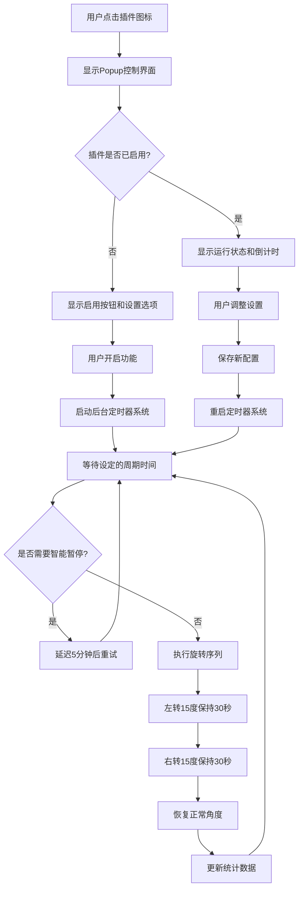
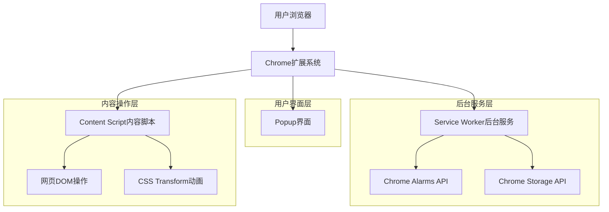

# 颈椎治疗浏览器插件产品需求文档

## 1. 产品概述

颈椎治疗浏览器插件（Dogtor）是一款专为长时间使用电脑的用户设计的Chrome浏览器扩展程序。通过周期性旋转网页内容来提醒用户进行颈椎锻炼，帮助预防和缓解颈椎病症状。该插件采用无侵入式设计，在不影响用户正常浏览体验的前提下，通过技术手段促进用户颈椎健康。

- 该产品解决长时间使用电脑导致的颈椎僵硬和疼痛问题，主要面向办公人群、程序员、学生等需要长时间面对电脑的用户群体。
- 产品通过定期的视觉提醒和强制性的颈椎运动，帮助用户养成良好的颈椎保健习惯，预防颈椎病的发生。

## 2. 核心功能

### 2.1 用户角色
本产品面向所有Chrome浏览器用户，无需注册或登录，安装即可使用。所有用户享有相同的功能权限。

### 2.2 功能模块

我们的颈椎治疗插件包含以下核心页面：
1. **Popup控制界面**：主控制面板，包含功能开关、参数设置、状态显示
2. **网页状态指示器**：嵌入式状态提示，显示旋转进度和倒计时信息
3. **高级设置页面**：详细配置界面，支持个性化参数调整

### 2.3 页面详情

| 页面名称 | 模块名称 | 功能描述 |
|---------|---------|----------|
| Popup控制界面 | 主功能开关 | 启用/禁用插件功能，显示当前运行状态 |
| Popup控制界面 | 角度设置模块 | 调整旋转角度（0-45度），包含可视化量角器和滑块控制 |
| Popup控制界面 | 周期设置模块 | 设置旋转周期（1-60分钟），包含时钟图标和滑块控制 |
| Popup控制界面 | 状态显示模块 | 显示下次旋转倒计时和插件运行状态 |
| Popup控制界面 | 品牌展示模块 | 显示Dogtor品牌标识和健康提示信息 |
| 网页状态指示器 | 旋转提示模块 | 显示当前旋转方向（左转/右转）和剩余时间 |
| 网页状态指示器 | 倒计时显示模块 | 显示下次旋转的倒计时信息，支持点击隐藏 |
| 高级设置页面 | 高级参数配置 | 配置旋转时长（10-120秒）、排除域名列表、智能暂停等 |
| 高级设置页面 | 统计信息模块 | 显示使用统计、健康数据和使用建议 |

## 3. 核心流程

### 3.1 主要用户操作流程

**基础使用流程：**
1. 用户安装插件后，点击浏览器工具栏中的Dogtor图标
2. 在弹出的控制界面中，用户开启"自动旋转提醒"开关
3. 用户可根据个人需求调整旋转角度（默认15度）和旋转周期（默认10分钟）
4. 系统开始周期性定时器，在设定时间到达时执行旋转序列
5. 旋转序列包括：左转指定角度保持30秒 → 右转指定角度保持30秒 → 恢复正常角度
6. 用户可随时通过控制界面调整设置或关闭功能

**高级设置流程：**
1. 用户在主控制界面点击"高级设置"按钮
2. 进入详细配置页面，可设置旋转时长、排除特定网站、启用智能暂停等
3. 系统实时保存所有设置更改，并同步到所有已打开的标签页

### 3.2 系统流程图



## 4. 用户界面设计

### 4.1 设计风格

**整体设计理念：**
- **主色调**：蓝色系（#3B82F6）传达专业和信任感，灰色系（#6B7280, #9CA3AF）提供良好的层次感
- **按钮风格**：圆角矩形设计，支持悬停和点击状态的视觉反馈，提升交互体验
- **字体设计**：采用系统默认字体确保兼容性，主标题18px，正文16px，说明文字14px
- **布局风格**：卡片式布局设计，320px固定宽度适配浏览器扩展标准，顶部品牌区域，内容区域模块化分块
- **图标风格**：线性图标风格配合Dogtor品牌形象，简洁现代，支持健康主题的视觉传达

### 4.2 页面设计概览

| 页面名称 | 模块名称 | UI元素 |
|---------|---------|--------|
| Popup控制界面 | 品牌头部区域 | 渐变紫蓝色背景，Dogtor圆形头像，白色品牌标题和副标题 |
| Popup控制界面 | 主开关区域 | 大型iOS风格切换开关，功能说明文字，状态指示 |
| Popup控制界面 | 角度设置区域 | SVG量角器可视化组件，动态角度指示线，数值显示，蓝色滑块控制器 |
| Popup控制界面 | 周期设置区域 | 时钟线性图标，周期数值高亮显示，范围标签，滑块控制器 |
| Popup控制界面 | 状态显示区域 | 灰色背景卡片，绿色脉动状态点，倒计时文字，淡入动画效果 |
| Popup控制界面 | 底部区域 | 浅灰背景，健康提示文字，红色爱心图标，温馨提醒 |
| 网页状态指示器 | 浮动提示框 | 半透明黑色背景，白色文字，8px圆角，右上角固定定位，点击隐藏功能 |
| 高级设置页面 | 参数配置区域 | 表单式布局，分组设置项，开关和输入框组合，实时保存提示 |

### 4.3 响应式设计

插件采用固定尺寸设计策略，主要针对桌面端Chrome浏览器进行优化。Popup界面采用320px固定宽度，高度根据内容自适应调整。网页内的状态指示器采用固定定位方式，确保在各种网页布局和屏幕尺寸下都能正常显示和交互。对于小屏幕设备，提供响应式调整以确保基本功能的可用性。

## 5. 技术架构设计

### 5.1 整体架构



### 5.2 技术描述

- **前端**：HTML5 + CSS3 + JavaScript ES6+
- **扩展框架**：Chrome Manifest V3
- **后台服务**：Service Worker + Chrome Alarms API + Chrome Storage API

### 5.3 路由定义

| 路由 | 用途 |
|------|------|
| popup.html | 主控制界面，显示插件状态和基础设置选项 |
| options.html | 高级设置页面，提供详细配置和统计信息 |
| background/service-worker.js | 后台服务，处理定时器管理和状态协调 |
| content/content-script.js | 内容脚本，执行DOM操作和动画效果 |

### 5.4 API定义

#### 5.4.1 核心消息API

**启动旋转功能**
```
Message Type: START_ROTATION
```

请求参数：
| 参数名称 | 参数类型 | 是否必需 | 描述 |
|---------|---------|---------|------|
| settings | object | true | 旋转参数配置对象 |
| settings.cycleDuration | number | true | 旋转周期（毫秒，默认600000） |
| settings.rotationDuration | number | true | 单次旋转时长（毫秒，默认30000） |
| settings.rotationAngle | number | true | 旋转角度（度，默认15） |
| settings.isEnabled | boolean | true | 是否启用功能 |

响应参数：
| 参数名称 | 参数类型 | 描述 |
|---------|---------|------|
| success | boolean | 操作是否成功 |
| message | string | 响应消息 |
| nextRotationTime | number | 下次旋转时间戳 |

示例：
```json
{
  "type": "START_ROTATION",
  "payload": {
    "settings": {
      "cycleDuration": 600000,
      "rotationDuration": 30000,
      "rotationAngle": 15,
      "isEnabled": true
    }
  },
  "timestamp": 1703123456789
}
```

**停止旋转功能**
```
Message Type: STOP_ROTATION
```

请求参数：
| 参数名称 | 参数类型 | 是否必需 | 描述 |
|---------|---------|---------|------|
| immediate | boolean | false | 是否立即停止（默认true） |

响应参数：
| 参数名称 | 参数类型 | 描述 |
|---------|---------|------|
| success | boolean | 操作是否成功 |
| message | string | 响应消息 |

**执行旋转序列**
```
Message Type: EXECUTE_SEQUENCE
```

请求参数：
| 参数名称 | 参数类型 | 是否必需 | 描述 |
|---------|---------|---------|------|
| angle | number | true | 旋转角度（度） |
| duration | number | true | 旋转时长（毫秒） |
| direction | string | true | 旋转方向（left/right/reset） |
| phase | string | true | 当前阶段（idle/left/right） |

响应参数：
| 参数名称 | 参数类型 | 描述 |
|---------|---------|------|
| success | boolean | 操作是否成功 |
| currentAngle | number | 当前旋转角度 |
| phase | string | 当前阶段 |

### 5.5 数据模型

#### 5.5.1 用户设置数据结构

```javascript
interface UserSettings {
  // 基础功能设置
  isEnabled: boolean;           // 插件是否启用（默认false）
  cycleDuration: number;        // 旋转周期毫秒数（默认600000，即10分钟）
  rotationDuration: number;     // 单次旋转时长毫秒数（默认30000，即30秒）
  rotationAngle: number;        // 旋转角度（默认15度，范围0-45度）
  
  // 高级功能设置
  showIndicator: boolean;       // 是否显示状态指示器（默认true）
  enableSound: boolean;         // 是否启用声音提示（默认false）
  excludedDomains: string[];    // 排除的域名列表（默认空数组）
  smartPause: boolean;          // 智能暂停功能（默认true）
  
  // 元数据信息
  version: string;              // 设置版本号
  lastModified: number;         // 最后修改时间戳
  installDate: number;          // 安装日期时间戳
}
```

#### 5.5.2 运行状态数据结构

```javascript
interface RuntimeState {
  // 当前运行状态
  isActive: boolean;            // 是否正在运行
  currentPhase: 'idle' | 'left' | 'right'; // 当前旋转阶段
  nextRotationTime: number;     // 下次旋转时间戳
  currentAngle: number;         // 当前旋转角度
  
  // 定时器管理状态
  alarmName: string;            // 当前活动的alarm名称
  cycleStartTime: number;       // 当前周期开始时间
  phaseStartTime: number;       // 当前阶段开始时间
  
  // 使用统计信息
  totalRotations: number;       // 总旋转次数
  todayRotations: number;       // 今日旋转次数
  lastRotationTime: number;     // 上次旋转时间
  totalActiveTime: number;      // 总活跃时间（毫秒）
  
  // 会话管理信息
  sessionStartTime: number;     // 会话开始时间
  activeTabId: number;          // 当前活动标签页ID
  lastHeartbeat: number;        // 最后心跳时间
}
```

## 6. 功能需求详细说明

### 6.1 周期性自动旋转功能

**功能描述：**
系统按照用户设定的时间间隔，自动执行网页旋转序列，帮助用户进行颈椎锻炼。

**具体需求：**
- 支持1-60分钟的周期设置，默认10分钟
- 旋转序列包括：左转→右转→恢复，每个阶段持续30秒
- 旋转角度可调节，范围0-45度，默认15度
- 使用CSS Transform实现平滑的2秒过渡动画
- 支持跨标签页同步，所有页面同时执行旋转

**验收标准：**
1. 用户启用功能后，系统能够按设定周期准确触发旋转
2. 旋转动画流畅自然，不影响页面内容的可读性
3. 旋转完成后页面能够完全恢复到原始状态
4. 多个标签页能够同步执行旋转动画
5. 系统能够准确记录和显示下次旋转的倒计时

### 6.2 功能开关和状态管理

**功能描述：**
提供直观的功能开关控制，并实时显示插件运行状态。

**具体需求：**
- 主控制界面提供大型切换开关
- 实时显示插件启用/禁用状态
- 显示下次旋转的倒计时信息
- 支持一键启用/禁用所有功能
- 状态变更能够立即同步到所有标签页

**验收标准：**
1. 开关状态变更能够立即生效
2. 状态显示准确反映当前插件运行情况
3. 倒计时信息实时更新且准确
4. 禁用功能时能够立即停止所有旋转动画
5. 状态信息在浏览器重启后能够正确恢复

### 6.3 自定义设置功能

**功能描述：**
允许用户根据个人需求自定义旋转参数和高级选项。

**具体需求：**
- 旋转角度调节：0-45度，支持滑块和数值显示
- 旋转周期调节：1-60分钟，支持滑块控制
- 旋转时长设置：10-120秒，在高级设置中配置
- 排除域名功能：支持添加不需要旋转的网站
- 智能暂停功能：检测用户活动状态，避免干扰

**验收标准：**
1. 所有设置项能够实时保存和应用
2. 滑块控制响应流畅，数值显示准确
3. 排除域名功能能够正确识别和跳过指定网站
4. 智能暂停能够检测用户输入、视频播放等活动
5. 设置在不同设备间能够同步（通过Chrome同步）

### 6.4 跨网站兼容性

**功能描述：**
确保插件在各种类型的网站上都能正常工作。

**具体需求：**
- 支持静态HTML网站、SPA应用、视频网站等
- 自动检测页面兼容性，对不兼容页面进行跳过
- 处理特殊页面（如chrome://页面）的兼容性问题
- 支持动态加载内容的网站
- 提供兼容性问题的错误处理和用户提示

**验收标准：**
1. 在主流网站（YouTube、Google、GitHub等）上正常工作
2. 对不兼容页面能够优雅降级，不产生错误
3. 动态内容加载不影响插件功能
4. 特殊协议页面（chrome://、file://）能够正确跳过
5. 兼容性问题有明确的错误提示和解决建议

### 6.5 状态提示和用户反馈

**功能描述：**
通过视觉提示为用户提供清晰的状态反馈和操作指导。

**具体需求：**
- 网页右上角显示状态指示器
- 旋转过程中显示当前阶段和剩余时间
- 倒计时显示下次旋转时间
- 支持点击隐藏状态指示器
- 提供错误状态的友好提示信息

**验收标准：**
1. 状态指示器在所有网站上都能正确显示
2. 旋转过程中的提示信息准确且易理解
3. 倒计时信息实时更新，误差在5秒以内
4. 状态指示器不遮挡重要页面内容
5. 错误提示能够帮助用户理解和解决问题

## 7. 非功能性需求

### 7.1 性能要求

- **内存使用**：Service Worker内存占用不超过10MB，Content Script不超过5MB
- **CPU使用**：旋转动画执行期间CPU使用率不超过20%
- **启动时间**：插件初始化时间不超过500毫秒
- **响应时间**：UI操作响应时间不超过100毫秒
- **动画性能**：旋转动画保持60FPS的流畅度

### 7.2 兼容性要求

- **浏览器支持**：Chrome 90+版本
- **操作系统**：Windows 10+、macOS 10.14+、Linux主流发行版
- **网站兼容**：支持95%以上的主流网站
- **屏幕分辨率**：支持1366x768及以上分辨率

### 7.3 安全性要求

- **权限最小化**：仅申请必要的Chrome API权限
- **数据安全**：用户设置数据加密存储
- **隐私保护**：不收集用户浏览数据
- **内容安全**：防止XSS攻击和代码注入

### 7.4 可用性要求

- **易用性**：新用户能够在30秒内完成基础设置
- **可访问性**：支持键盘导航和屏幕阅读器
- **国际化**：支持中英文界面切换
- **帮助文档**：提供完整的使用说明和FAQ

## 8. 验收标准总结

### 8.1 功能验收标准

1. **基础功能**：旋转功能能够按设定参数正常执行
2. **设置管理**：所有设置项能够正确保存和应用
3. **状态同步**：多标签页状态能够实时同步
4. **兼容性**：在主流网站上正常工作
5. **错误处理**：异常情况有适当的处理和提示

### 8.2 性能验收标准

1. **响应速度**：UI操作响应时间<100ms
2. **资源占用**：内存使用符合限制要求
3. **动画流畅度**：旋转动画保持60FPS
4. **启动速度**：插件初始化<500ms
5. **稳定性**：连续运行24小时无崩溃

### 8.3 用户体验验收标准

1. **易用性**：新用户30秒内完成设置
2. **视觉设计**：界面美观且符合品牌风格
3. **交互反馈**：所有操作有明确的视觉反馈
4. **错误提示**：错误信息友好且具有指导性
5. **帮助支持**：提供完整的使用文档

## 9. 项目里程碑

### 9.1 开发阶段里程碑

- **第1-2天**：项目初始化和基础架构搭建
- **第3-5天**：核心功能开发（Service Worker + Content Script）
- **第6-7天**：用户界面开发（Popup + Options页面）
- **第8-9天**：测试和优化（单元测试 + 集成测试）
- **第10天**：部署和发布准备

### 9.2 质量保证里程碑

- **功能测试完成**：所有核心功能通过测试
- **性能测试通过**：满足所有性能指标要求
- **兼容性验证**：在目标环境中正常运行
- **安全审计完成**：通过安全性检查
- **用户验收测试**：目标用户群体验收通过

### 9.3 发布里程碑

- **Chrome Web Store提交**：完成应用商店提交
- **审核通过**：通过Chrome Web Store审核
- **正式发布**：向公众开放下载
- **用户反馈收集**：收集初期用户反馈
- **迭代优化**：基于反馈进行功能优化

本产品需求文档为颈椎治疗浏览器插件的开发提供了全面的指导，确保产品能够满足用户需求并达到预期的质量标准。