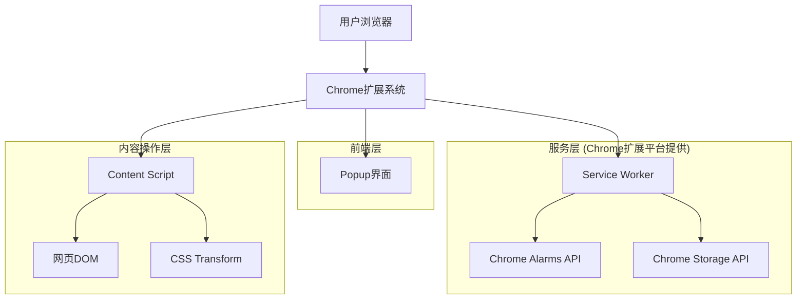
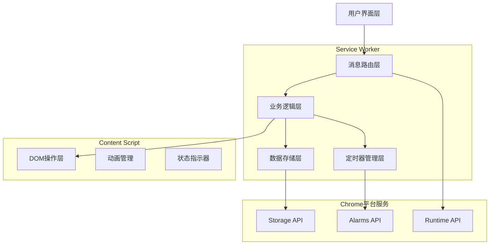
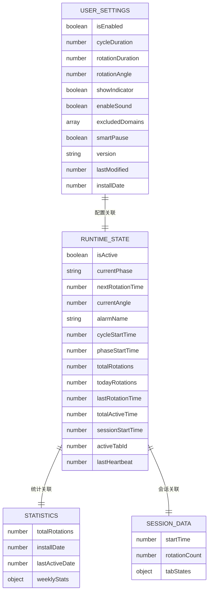

# 颈椎治疗浏览器插件技术架构文档

## 1. 架构设计



## 2. 技术描述

- **前端**：HTML5 + CSS3 + JavaScript ES6+ + Chrome Extension APIs
- **后台服务**：Chrome Manifest V3 Service Worker + Chrome Alarms API + Chrome Storage API

## 3. 路由定义

| 路由 | 用途 |
|------|------|
| popup.html | 主控制界面，显示插件状态和基础设置选项 |
| options.html | 高级设置页面，提供详细配置和统计信息 |
| background/service-worker.js | 后台服务，处理定时器管理和状态协调 |
| content/content-script.js | 内容脚本，执行DOM操作和动画效果 |
| utils/constants.js | 常量定义文件，包含消息类型和默认配置 |
| utils/storage.js | 存储管理工具类，封装Chrome Storage API |
| utils/messaging.js | 消息通信工具类，处理组件间通信 |

## 4. API定义

### 4.1 核心消息API

**启动旋转功能**
```
POST chrome.runtime.sendMessage
```

请求参数：
| 参数名称 | 参数类型 | 是否必需 | 描述 |
|---------|---------|---------|------|
| type | string | true | 消息类型："START_ROTATION" |
| payload | object | true | 旋转参数配置对象 |
| payload.settings | object | true | 用户设置对象 |
| payload.settings.cycleDuration | number | true | 旋转周期（毫秒） |
| payload.settings.rotationDuration | number | true | 单次旋转时长（毫秒） |
| payload.settings.rotationAngle | number | true | 旋转角度（度） |

响应参数：
| 参数名称 | 参数类型 | 描述 |
|---------|---------|------|
| success | boolean | 操作是否成功 |
| message | string | 响应消息 |
| nextRotationTime | number | 下次旋转时间戳 |

示例：
```json
{
  "type": "START_ROTATION",
  "payload": {
    "settings": {
      "cycleDuration": 600000,
      "rotationDuration": 30000,
      "rotationAngle": 15
    }
  },
  "timestamp": 1703123456789
}
```

**停止旋转功能**
```
POST chrome.runtime.sendMessage
```

请求参数：
| 参数名称 | 参数类型 | 是否必需 | 描述 |
|---------|---------|---------|------|
| type | string | true | 消息类型："STOP_ROTATION" |
| payload | object | false | 可选参数对象 |
| payload.immediate | boolean | false | 是否立即停止（默认true） |

响应参数：
| 参数名称 | 参数类型 | 描述 |
|---------|---------|------|
| success | boolean | 操作是否成功 |
| message | string | 响应消息 |

**执行旋转序列**
```
POST chrome.tabs.sendMessage
```

请求参数：
| 参数名称 | 参数类型 | 是否必需 | 描述 |
|---------|---------|---------|------|
| type | string | true | 消息类型："EXECUTE_SEQUENCE" |
| payload | object | true | 执行参数对象 |
| payload.angle | number | true | 旋转角度（度） |
| payload.duration | number | true | 旋转时长（毫秒） |
| payload.direction | string | true | 旋转方向（left/right/reset） |
| payload.phase | string | true | 当前阶段（idle/left/right） |

响应参数：
| 参数名称 | 参数类型 | 描述 |
|---------|---------|------|
| success | boolean | 操作是否成功 |
| currentAngle | number | 当前旋转角度 |
| phase | string | 当前阶段 |

**获取状态信息**
```
POST chrome.runtime.sendMessage
```

请求参数：
| 参数名称 | 参数类型 | 是否必需 | 描述 |
|---------|---------|---------|------|
| type | string | true | 消息类型："GET_STATE" |

响应参数：
| 参数名称 | 参数类型 | 描述 |
|---------|---------|------|
| success | boolean | 操作是否成功 |
| state | object | 当前运行状态对象 |
| settings | object | 当前用户设置对象 |

示例：
```json
{
  "success": true,
  "state": {
    "isActive": true,
    "currentPhase": "idle",
    "nextRotationTime": 1703123456789,
    "totalRotations": 42
  },
  "settings": {
    "isEnabled": true,
    "cycleDuration": 600000,
    "rotationAngle": 15
  }
}
```

### 4.2 Chrome Storage API

**用户设置存储**
```
chrome.storage.sync.set/get
```

存储键值：
| 键名 | 数据类型 | 描述 |
|------|---------|------|
| user_settings | object | 用户配置设置 |
| statistics | object | 使用统计数据 |
| preferences | object | 用户偏好设置 |

**运行状态存储**
```
chrome.storage.local.set/get
```

存储键值：
| 键名 | 数据类型 | 描述 |
|------|---------|------|
| runtime_state | object | 当前运行状态 |
| session_data | object | 会话数据 |
| cache | object | 缓存数据 |

### 4.3 Chrome Alarms API

**创建定时器**
```
chrome.alarms.create
```

参数：
| 参数名称 | 参数类型 | 是否必需 | 描述 |
|---------|---------|---------|------|
| name | string | true | 定时器名称 |
| alarmInfo | object | true | 定时器配置 |
| alarmInfo.delayInMinutes | number | true | 延迟时间（分钟） |

**清除定时器**
```
chrome.alarms.clear/clearAll
```

## 5. 服务架构图



## 6. 数据模型

### 6.1 数据模型定义



### 6.2 数据定义语言

**用户设置表 (Chrome Storage Sync)**
```javascript
// 创建默认设置
const DEFAULT_SETTINGS = {
  // 基础功能设置
  isEnabled: false,                    // 插件是否启用
  cycleDuration: 10 * 60 * 1000,      // 旋转周期（毫秒）
  rotationDuration: 30 * 1000,        // 单次旋转时长（毫秒）
  rotationAngle: 15,                   // 旋转角度（度）
  
  // 高级功能设置
  showIndicator: true,                 // 是否显示状态指示器
  enableSound: false,                  // 是否启用声音提示
  excludedDomains: [],                 // 排除的域名列表
  smartPause: true,                    // 智能暂停功能
  
  // 元数据
  version: '1.0.0',                   // 设置版本号
  lastModified: Date.now(),           // 最后修改时间戳
  installDate: Date.now()             // 安装日期时间戳
};

// 保存用户设置
async function saveUserSettings(settings) {
  const updatedSettings = {
    ...settings,
    lastModified: Date.now()
  };
  await chrome.storage.sync.set({ user_settings: updatedSettings });
}

// 获取用户设置
async function getUserSettings() {
  const result = await chrome.storage.sync.get('user_settings');
  return { ...DEFAULT_SETTINGS, ...result.user_settings };
}
```

**运行状态表 (Chrome Storage Local)**
```javascript
// 创建默认运行状态
const DEFAULT_RUNTIME_STATE = {
  // 当前状态
  isActive: false,                     // 是否正在运行
  currentPhase: 'idle',               // 当前旋转阶段
  nextRotationTime: 0,                // 下次旋转时间戳
  currentAngle: 0,                    // 当前旋转角度
  
  // 定时器状态
  alarmName: '',                      // 当前活动的alarm名称
  cycleStartTime: 0,                  // 当前周期开始时间
  phaseStartTime: 0,                  // 当前阶段开始时间
  
  // 统计信息
  totalRotations: 0,                  // 总旋转次数
  todayRotations: 0,                  // 今日旋转次数
  lastRotationTime: 0,                // 上次旋转时间
  totalActiveTime: 0,                 // 总活跃时间（毫秒）
  
  // 会话信息
  sessionStartTime: Date.now(),       // 会话开始时间
  activeTabId: -1,                    // 当前活动标签页ID
  lastHeartbeat: Date.now()           // 最后心跳时间
};

// 保存运行状态
async function saveRuntimeState(state) {
  await chrome.storage.local.set({ runtime_state: state });
}

// 获取运行状态
async function getRuntimeState() {
  const result = await chrome.storage.local.get('runtime_state');
  return { ...DEFAULT_RUNTIME_STATE, ...result.runtime_state };
}
```

**统计数据表 (Chrome Storage Sync)**
```javascript
// 创建统计数据结构
const STATISTICS_SCHEMA = {
  totalRotations: 0,                   // 总旋转次数
  installDate: Date.now(),            // 安装日期
  lastActiveDate: Date.now(),         // 最后活跃日期
  weeklyStats: {                      // 周统计数据
    // 格式：'YYYY-WW': { rotations: number, activeTime: number }
  },
  monthlyStats: {                     // 月统计数据
    // 格式：'YYYY-MM': { rotations: number, activeTime: number }
  }
};

// 更新统计数据
async function updateStatistics(rotationCount = 1, activeTime = 0) {
  const result = await chrome.storage.sync.get('statistics');
  const stats = { ...STATISTICS_SCHEMA, ...result.statistics };
  
  // 更新总计数据
  stats.totalRotations += rotationCount;
  stats.lastActiveDate = Date.now();
  
  // 更新周统计
  const weekKey = getWeekKey(new Date());
  if (!stats.weeklyStats[weekKey]) {
    stats.weeklyStats[weekKey] = { rotations: 0, activeTime: 0 };
  }
  stats.weeklyStats[weekKey].rotations += rotationCount;
  stats.weeklyStats[weekKey].activeTime += activeTime;
  
  // 更新月统计
  const monthKey = getMonthKey(new Date());
  if (!stats.monthlyStats[monthKey]) {
    stats.monthlyStats[monthKey] = { rotations: 0, activeTime: 0 };
  }
  stats.monthlyStats[monthKey].rotations += rotationCount;
  stats.monthlyStats[monthKey].activeTime += activeTime;
  
  await chrome.storage.sync.set({ statistics: stats });
}

// 获取周键值
function getWeekKey(date) {
  const year = date.getFullYear();
  const week = getWeekNumber(date);
  return `${year}-W${week.toString().padStart(2, '0')}`;
}

// 获取月键值
function getMonthKey(date) {
  const year = date.getFullYear();
  const month = date.getMonth() + 1;
  return `${year}-${month.toString().padStart(2, '0')}`;
}

// 获取周数
function getWeekNumber(date) {
  const firstDayOfYear = new Date(date.getFullYear(), 0, 1);
  const pastDaysOfYear = (date - firstDayOfYear) / 86400000;
  return Math.ceil((pastDaysOfYear + firstDayOfYear.getDay() + 1) / 7);
}
```

**会话数据表 (Chrome Storage Local)**
```javascript
// 创建会话数据结构
const SESSION_DATA_SCHEMA = {
  startTime: Date.now(),              // 会话开始时间
  rotationCount: 0,                   // 本次会话旋转次数
  tabStates: {                        // 标签页状态
    // 格式：tabId: { isRotating: boolean, currentAngle: number, lastUpdate: number }
  },
  userActivity: {                     // 用户活动记录
    lastInputTime: 0,                 // 最后输入时间
    lastScrollTime: 0,                // 最后滚动时间
    lastClickTime: 0                  // 最后点击时间
  }
};

// 更新会话数据
async function updateSessionData(updates) {
  const result = await chrome.storage.local.get('session_data');
  const sessionData = { ...SESSION_DATA_SCHEMA, ...result.session_data, ...updates };
  await chrome.storage.local.set({ session_data: sessionData });
}

// 更新标签页状态
async function updateTabState(tabId, state) {
  const result = await chrome.storage.local.get('session_data');
  const sessionData = { ...SESSION_DATA_SCHEMA, ...result.session_data };
  
  if (!sessionData.tabStates[tabId]) {
    sessionData.tabStates[tabId] = {
      isRotating: false,
      currentAngle: 0,
      lastUpdate: Date.now()
    };
  }
  
  sessionData.tabStates[tabId] = {
    ...sessionData.tabStates[tabId],
    ...state,
    lastUpdate: Date.now()
  };
  
  await chrome.storage.local.set({ session_data: sessionData });
}
```

**缓存数据表 (Chrome Storage Local)**
```javascript
// 创建缓存数据结构
const CACHE_SCHEMA = {
  lastKnownSettings: null,            // 最后已知的设置
  domainCompatibility: {              // 域名兼容性缓存
    // 格式：domain: { compatible: boolean, lastChecked: number, issues: string[] }
  },
  performanceMetrics: {               // 性能指标缓存
    averageRotationTime: 0,           // 平均旋转时间
    memoryUsage: 0,                   // 内存使用量
    cpuUsage: 0,                      // CPU使用率
    lastMeasured: 0                   // 最后测量时间
  }
};

// 更新域名兼容性缓存
async function updateDomainCompatibility(domain, compatible, issues = []) {
  const result = await chrome.storage.local.get('cache');
  const cache = { ...CACHE_SCHEMA, ...result.cache };
  
  cache.domainCompatibility[domain] = {
    compatible,
    lastChecked: Date.now(),
    issues
  };
  
  await chrome.storage.local.set({ cache });
}

// 获取域名兼容性信息
async function getDomainCompatibility(domain) {
  const result = await chrome.storage.local.get('cache');
  const cache = { ...CACHE_SCHEMA, ...result.cache };
  
  const domainInfo = cache.domainCompatibility[domain];
  if (!domainInfo) {
    return null;
  }
  
  // 检查缓存是否过期（24小时）
  const cacheAge = Date.now() - domainInfo.lastChecked;
  if (cacheAge > 24 * 60 * 60 * 1000) {
    return null;
  }
  
  return domainInfo;
}
```

## 7. 组件架构设计

### 7.1 Service Worker架构

```javascript
// Service Worker主要职责
class NeckTherapyServiceWorker {
  constructor() {
    this.messageRouter = new MessageRouter();
    this.timerManager = new TimerManager();
    this.stateManager = new StateManager();
    this.storageManager = new StorageManager();
  }
  
  // 消息路由处理
  handleMessage(message, sender, sendResponse) {
    return this.messageRouter.route(message, sender, sendResponse);
  }
  
  // 定时器事件处理
  handleAlarm(alarm) {
    return this.timerManager.handleAlarm(alarm);
  }
  
  // 标签页事件处理
  handleTabUpdate(tabId, changeInfo, tab) {
    return this.stateManager.handleTabUpdate(tabId, changeInfo, tab);
  }
}
```

### 7.2 Content Script架构

```javascript
// Content Script主要职责
class NeckTherapyContentScript {
  constructor() {
    this.animationManager = new AnimationManager();
    this.statusIndicator = new StatusIndicator();
    this.compatibilityChecker = new CompatibilityChecker();
    this.userActivityDetector = new UserActivityDetector();
  }
  
  // 执行旋转动画
  executeRotation(params) {
    return this.animationManager.rotateToAngle(params);
  }
  
  // 显示状态指示器
  showStatus(message, duration) {
    return this.statusIndicator.show(message, duration);
  }
  
  // 检测用户活动
  isUserActive() {
    return this.userActivityDetector.isActive();
  }
}
```

### 7.3 Popup界面架构

```javascript
// Popup控制器
class PopupController {
  constructor() {
    this.viewManager = new ViewManager();
    this.settingsManager = new SettingsManager();
    this.statusUpdater = new StatusUpdater();
  }
  
  // 初始化界面
  async init() {
    await this.loadCurrentData();
    this.setupEventListeners();
    this.updateUI();
    this.startStatusUpdater();
  }
  
  // 处理设置变更
  handleSettingsChange(setting, value) {
    return this.settingsManager.updateSetting(setting, value);
  }
}
```

## 8. 安全架构

### 8.1 权限控制

```json
{
  "permissions": [
    "storage",      // 数据存储权限
    "alarms",       // 定时器权限
    "activeTab",    // 活动标签页权限
    "scripting"     // 脚本注入权限
  ],
  "host_permissions": [
    "<all_urls>"    // 所有网站访问权限（仅用于内容脚本注入）
  ]
}
```

### 8.2 内容安全策略

```json
{
  "content_security_policy": {
    "extension_pages": "script-src 'self'; object-src 'self';"
  }
}
```

### 8.3 数据安全

- **敏感数据加密**：用户设置使用Chrome Storage API的内置加密
- **权限最小化**：仅申请必要的API权限
- **输入验证**：所有用户输入进行严格验证
- **XSS防护**：Content Script使用安全的DOM操作方法

## 9. 性能优化架构

### 9.1 内存管理

- **对象池模式**：复用动画对象减少GC压力
- **事件监听器管理**：及时清理不需要的事件监听器
- **定时器优化**：使用Chrome Alarms API替代setInterval

### 9.2 CPU优化

- **动画优化**：使用CSS Transform硬件加速
- **防抖节流**：用户输入事件使用防抖处理
- **异步处理**：所有I/O操作使用异步模式

### 9.3 存储优化

- **数据分层**：频繁访问数据使用local存储，设置数据使用sync存储
- **缓存策略**：兼容性检查结果进行缓存
- **数据压缩**：统计数据使用压缩格式存储

本技术架构文档为颈椎治疗浏览器插件提供了完整的技术实现指导，确保系统的可扩展性、可维护性和高性能。