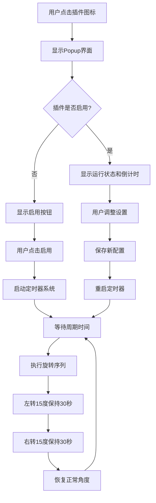
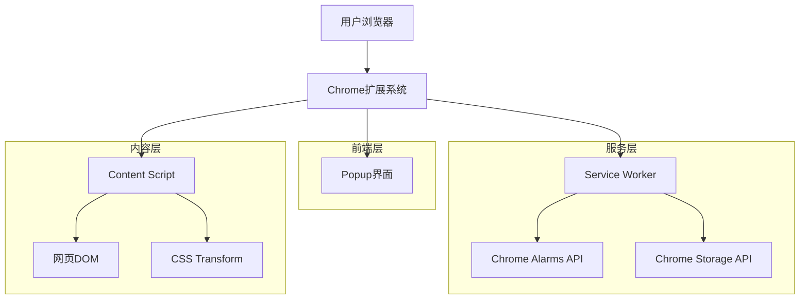

# 颈椎治疗浏览器插件技术实现方案

## 1. 产品概述

颈椎治疗浏览器插件是一个基于Chrome Manifest V3的扩展程序，通过周期性旋转网页内容来帮助用户进行颈椎锻炼。该插件采用CSS Transform技术实现平滑的网页旋转动画，结合Chrome Alarms API进行精确的定时控制，为长时间使用电脑的用户提供颈椎保健功能。

### 1.1 核心功能

* 周期性自动旋转网页（默认每10分钟左转15度30秒，右转15度30秒）

* 功能开关控制和状态管理

* 自定义旋转参数设置（周期1-60分钟，时长10-120秒，角度0-45度）

* 跨网站兼容性和错误处理

* 实时状态指示器和用户反馈

### 1.2 技术特点

* **健康导向**：通过技术手段促进用户颈椎健康

* **无侵入性**：不影响用户正常浏览体验

* **高度可定制**：支持个性化设置以适应不同用户需求

* **跨网站兼容**：在任何网站上都能正常工作

## 2. 核心功能

### 2.1 用户角色

本插件面向所有Chrome浏览器用户，无需注册或登录，安装即可使用。

### 2.2 功能模块

我们的颈椎治疗插件包含以下核心页面：

1. **Popup界面**：主控制面板，包含开关控制、参数设置、状态显示
2. **状态指示器**：网页内嵌式状态提示，显示旋转进度和倒计时
3. **设置页面**：详细参数配置界面，支持高级选项设置

### 2.3 页面详情

| 页面名称    | 模块名称  | 功能描述                     |
| ------- | ----- | ------------------------ |
| Popup界面 | 主开关控制 | 启用/禁用插件功能，显示当前状态         |
| Popup界面 | 快速设置  | 调整旋转角度（0-45度）和周期（1-30分钟） |
| Popup界面 | 状态显示  | 显示下次旋转倒计时和插件运行状态         |
| Popup界面 | 品牌展示  | 显示Dogtor品牌标识和健康提示        |
| 状态指示器   | 旋转提示  | 显示当前旋转方向和剩余时间            |
| 状态指示器   | 倒计时显示 | 显示下次旋转的倒计时信息             |
| 设置页面    | 高级参数  | 配置旋转时长（10-120秒）、排除域名等    |
| 设置页面    | 统计信息  | 显示使用统计和健康数据              |

## 3. 核心流程

### 3.1 用户操作流程

**主要用户流程：**

1. 用户点击插件图标打开Popup界面
2. 用户开启自动旋转功能
3. 系统开始周期性定时器，等待触发时间
4. 到达设定时间后，系统执行旋转序列：左转→右转→恢复
5. 用户可随时通过Popup界面调整设置或关闭功能
6. 系统在网页上显示状态指示器，提供实时反馈

**设置配置流程：**

1. 用户在Popup界面调整基础参数（角度、周期）
2. 用户点击高级设置进入详细配置页面
3. 用户配置旋转时长、排除域名等高级选项
4. 系统实时保存设置并应用新配置

### 3.2 系统流程图



## 4. 用户界面设计

### 4.1 设计风格

**整体设计风格：**

* **主色调**：蓝色系（#3B82F6）作为主色，灰色系（#6B7280, #9CA3AF）作为辅助色

* **按钮风格**：圆角矩形按钮，支持悬停和点击状态变化

* **字体设计**：系统默认字体，主标题16px，正文14px，说明文字12px

* **布局风格**：卡片式布局，320px固定宽度，顶部导航，内容区域分块

* **图标风格**：线性图标配合Dogtor品牌形象，简洁现代

### 4.2 页面设计概览

| 页面名称    | 模块名称   | UI元素                         |
| ------- | ------ | ---------------------------- |
| Popup界面 | 头部区域   | Dogtor品牌标识，圆形头像，标题"颈椎健康提醒助手" |
| Popup界面 | 主开关区域  | 大型切换开关，状态文字，功能说明             |
| Popup界面 | 角度设置区域 | 量角器可视化组件，角度数值显示，滑块控制器        |
| Popup界面 | 周期设置区域 | 时钟图标，周期文字显示，滑块控制器            |
| Popup界面 | 状态显示区域 | 灰色背景卡片，状态点指示器，倒计时文字          |
| Popup界面 | 底部区域   | 健康提示文字，爱心图标，温馨提醒             |
| 状态指示器   | 浮动提示   | 半透明黑色背景，白色文字，圆角边框，右上角定位      |

### 4.3 响应式设计

插件采用固定尺寸设计，主要针对桌面端Chrome浏览器优化。Popup界面固定320px宽度，高度自适应内容。状态指示器采用固定定位，确保在各种网页布局中都能正常显示。

## 5. 技术架构设计

### 5.1 整体架构



### 5.2 技术栈

* **前端**：HTML5 + CSS3 + JavaScript ES6+

* **扩展框架**：Chrome Manifest V3

* **定时器系统**：Chrome Alarms API

* **数据存储**：Chrome Storage API (sync + local)

* **动画引擎**：CSS Transform + Transition

* **消息通信**：Chrome Runtime API

### 5.3 路由定义

| 路由            | 用途                        |
| ------------- | ------------------------- |
| popup.html    | 主控制界面，显示插件状态和基础设置         |
| options.html  | 高级设置页面，提供详细配置选项           |
| background.js | Service Worker，处理定时器和状态管理 |
| content.js    | 内容脚本，执行DOM操作和动画效果         |

### 5.4 API定义

#### 5.4.1 核心消息API

**启动旋转功能**

```
Message Type: START_ROTATION
```

请求参数：

| 参数名称                      | 参数类型   | 是否必需 | 描述         |
| ------------------------- | ------ | ---- | ---------- |
| settings                  | object | true | 旋转参数配置对象   |
| settings.cycleDuration    | number | true | 旋转周期（毫秒）   |
| settings.rotationDuration | number | true | 单次旋转时长（毫秒） |
| settings.rotationAngle    | number | true | 旋转角度（度）    |

响应参数：

| 参数名称             | 参数类型    | 描述      |
| ---------------- | ------- | ------- |
| success          | boolean | 操作是否成功  |
| message          | string  | 响应消息    |
| nextRotationTime | number  | 下次旋转时间戳 |

示例：

```json
{
  "type": "START_ROTATION",
  "payload": {
    "settings": {
      "cycleDuration": 600000,
      "rotationDuration": 30000,
      "rotationAngle": 15
    }
  },
  "timestamp": 1703123456789
}
```

**停止旋转功能**

```
Message Type: STOP_ROTATION
```

请求参数：

| 参数名称      | 参数类型    | 是否必需  | 描述             |
| --------- | ------- | ----- | -------------- |
| immediate | boolean | false | 是否立即停止（默认true） |

响应参数：

| 参数名称    | 参数类型    | 描述     |
| ------- | ------- | ------ |
| success | boolean | 操作是否成功 |
| message | string  | 响应消息   |

**执行旋转序列**

```
Message Type: EXECUTE_SEQUENCE
```

请求参数：

| 参数名称      | 参数类型   | 是否必需 | 描述                     |
| --------- | ------ | ---- | ---------------------- |
| angle     | number | true | 旋转角度                   |
| duration  | number | true | 旋转时长                   |
| direction | string | true | 旋转方向（left/right/reset） |

响应参数：

| 参数名称         | 参数类型    | 描述                    |
| ------------ | ------- | --------------------- |
| success      | boolean | 操作是否成功                |
| currentAngle | number  | 当前旋转角度                |
| phase        | string  | 当前阶段（idle/left/right） |

### 5.5 数据模型

#### 5.5.1 用户设置模型

```javascript
interface UserSettings {
  // 基础设置
  isEnabled: boolean;           // 插件是否启用
  cycleDuration: number;        // 旋转周期（毫秒，默认600000）
  rotationDuration: number;     // 单次旋转时长（毫秒，默认30000）
  rotationAngle: number;        // 旋转角度（度，默认15）
  
  // 高级设置
  showIndicator: boolean;       // 是否显示状态指示器（默认true）
  enableSound: boolean;         // 是否启用声音提示（默认false）
  excludedDomains: string[];    // 排除的域名列表
  smartPause: boolean;          // 智能暂停功能（检测用户活动）
  
  // 元数据
  version: string;              // 设置版本号
  lastModified: number;         // 最后修改时间戳
  installDate: number;          // 安装日期时间戳
}
```

#### 5.5.2 运行状态模型

```javascript
interface RuntimeState {
  // 当前状态
  isActive: boolean;            // 是否正在运行
  currentPhase: 'idle' | 'left' | 'right'; // 当前旋转阶段
  nextRotationTime: number;     // 下次旋转时间戳
  currentAngle: number;         // 当前旋转角度
  
  // 定时器状态
  alarmName: string;            // 当前活动的alarm名称
  cycleStartTime: number;       // 当前周期开始时间
  phaseStartTime: number;       // 当前阶段开始时间
  
  // 统计信息
  totalRotations: number;       // 总旋转次数
  todayRotations: number;       // 今日旋转次数
  lastRotationTime: number;     // 上次旋转时间
  totalActiveTime: number;      // 总活跃时间（毫秒）
  
  // 会话信息
  sessionStartTime: number;     // 会话开始时间
  activeTabId: number;          // 当前活动标签页ID
  lastHeartbeat: number;        // 最后心跳时间
}
```

#### 5.5.3 存储架构

```javascript
// Chrome Storage 结构设计
const StorageSchema = {
  // 同步存储（跨设备同步）
  sync: {
    'user_settings': UserSettings,
    'statistics': {
      totalRotations: number,
      installDate: number,
      lastActiveDate: number,
      weeklyStats: {
        [weekKey: string]: {
          rotations: number,
          activeTime: number
        }
      }
    },
    'preferences': {
      theme: 'light' | 'dark',
      language: 'zh-CN' | 'en-US',
      notifications: boolean
    }
  },
  
  // 本地存储（设备特定）
  local: {
    'runtime_state': RuntimeState,
    'session_data': {
      startTime: number,
      rotationCount: number,
      tabStates: {
        [tabId: string]: {
          isRotating: boolean,
          currentAngle: number,
          lastUpdate: number
        }
      }
    },
    'cache': {
      lastKnownSettings: UserSettings,
      domainCompatibility: {
        [domain: string]: {
          compatible: boolean,
          lastChecked: number,
          issues: string[]
        }
      }
    }
  }
};
```

## 6. 详细开发步骤

### 6.1 第一阶段：项目初始化和基础架构（第1-2天）

#### 步骤1.1：项目结构搭建

```bash
# 创建项目目录结构
neck-therapy-extension/
├── manifest.json
├── background/
│   └── service-worker.js
├── content/
│   ├── content-script.js
│   └── content-styles.css
├── popup/
│   ├── popup.html
│   ├── popup.js
│   └── popup.css
├── options/
│   ├── options.html
│   ├── options.js
│   └── options.css
├── assets/
│   ├── icons/
│   │   ├── icon16.png
│   │   ├── icon48.png
│   │   └── icon128.png
│   ├── images/
│   │   └── dogtor.png
│   └── sounds/
│       └── notification.mp3
├── utils/
│   ├── constants.js
│   ├── storage.js
│   └── messaging.js
└── tests/
    ├── unit/
    ├── integration/
    └── e2e/
```

#### 步骤1.2：Manifest V3配置

```json
{
  "manifest_version": 3,
  "name": "Dogtor - 颈椎健康提醒助手",
  "version": "1.0.0",
  "description": "通过周期性旋转网页帮助您进行颈椎锻炼，保护颈椎健康",
  
  "permissions": [
    "storage",
    "alarms",
    "activeTab",
    "scripting"
  ],
  
  "host_permissions": [
    "<all_urls>"
  ],
  
  "background": {
    "service_worker": "background/service-worker.js"
  },
  
  "content_scripts": [{
    "matches": ["<all_urls>"],
    "js": ["content/content-script.js"],
    "css": ["content/content-styles.css"],
    "run_at": "document_end"
  }],
  
  "action": {
    "default_popup": "popup/popup.html",
    "default_title": "Dogtor - 颈椎健康助手",
    "default_icon": {
      "16": "assets/icons/icon16.png",
      "48": "assets/icons/icon48.png",
      "128": "assets/icons/icon128.png"
    }
  },
  
  "options_page": "options/options.html",
  
  "icons": {
    "16": "assets/icons/icon16.png",
    "48": "assets/icons/icon48.png",
    "128": "assets/icons/icon128.png"
  }
}
```

#### 步骤1.3：基础工具类开发

**常量定义 (utils/constants.js)**

```javascript
// 消息类型常量
export const MESSAGE_TYPES = {
  START_ROTATION: 'start_rotation',
  STOP_ROTATION: 'stop_rotation',
  EXECUTE_SEQUENCE: 'execute_sequence',
  UPDATE_STATUS: 'update_status',
  SETTINGS_CHANGED: 'settings_changed',
  GET_STATE: 'get_state'
};

// 默认设置
export const DEFAULT_SETTINGS = {
  isEnabled: false,
  cycleDuration: 10 * 60 * 1000, // 10分钟
  rotationDuration: 30 * 1000,   // 30秒
  rotationAngle: 15,              // 15度
  showIndicator: true,
  enableSound: false,
  excludedDomains: [],
  smartPause: true
};

// 旋转阶段常量
export const ROTATION_PHASES = {
  IDLE: 'idle',
  LEFT: 'left',
  RIGHT: 'right'
};

// Alarm名称常量
export const ALARM_NAMES = {
  ROTATION_CYCLE: 'rotation_cycle',
  ROTATION_PHASE: 'rotation_phase'
};
```

**存储工具类 (utils/storage.js)**

```javascript
import { DEFAULT_SETTINGS } from './constants.js';

export class StorageManager {
  // 获取用户设置
  static async getSettings() {
    try {
      const result = await chrome.storage.sync.get('user_settings');
      return { ...DEFAULT_SETTINGS, ...result.user_settings };
    } catch (error) {
      console.error('获取设置失败:', error);
      return DEFAULT_SETTINGS;
    }
  }
  
  // 保存用户设置
  static async saveSettings(settings) {
    try {
      const updatedSettings = {
        ...settings,
        lastModified: Date.now()
      };
      await chrome.storage.sync.set({ user_settings: updatedSettings });
      return true;
    } catch (error) {
      console.error('保存设置失败:', error);
      return false;
    }
  }
  
  // 获取运行状态
  static async getRuntimeState() {
    try {
      const result = await chrome.storage.local.get('runtime_state');
      return result.runtime_state || {
        isActive: false,
        currentPhase: 'idle',
        nextRotationTime: 0,
        currentAngle: 0,
        totalRotations: 0,
        todayRotations: 0
      };
    } catch (error) {
      console.error('获取运行状态失败:', error);
      return null;
    }
  }
  
  // 保存运行状态
  static async saveRuntimeState(state) {
    try {
      await chrome.storage.local.set({ runtime_state: state });
      return true;
    } catch (error) {
      console.error('保存运行状态失败:', error);
      return false;
    }
  }
}
```

### 6.2 第二阶段：核心功能开发（第3-5天）

#### 步骤2.1：Service Worker开发

**Service Worker主文件 (background/service-worker.js)**

```javascript
import { MESSAGE_TYPES, ALARM_NAMES, ROTATION_PHASES } from '../utils/constants.js';
import { StorageManager } from '../utils/storage.js';

class NeckTherapyServiceWorker {
  constructor() {
    this.currentState = null;
    this.settings = null;
    this.init();
  }
  
  async init() {
    // 初始化设置和状态
    this.settings = await StorageManager.getSettings();
    this.currentState = await StorageManager.getRuntimeState();
    
    // 注册事件监听器
    this.setupEventListeners();
    
    // 恢复运行状态
    if (this.currentState.isActive) {
      await this.restoreActiveState();
    }
  }
  
  setupEventListeners() {
    // 监听消息
    chrome.runtime.onMessage.addListener((message, sender, sendResponse) => {
      this.handleMessage(message, sender, sendResponse);
      return true; // 保持消息通道开放
    });
    
    // 监听Alarm事件
    chrome.alarms.onAlarm.addListener((alarm) => {
      this.handleAlarm(alarm);
    });
    
    // 监听标签页更新
    chrome.tabs.onUpdated.addListener((tabId, changeInfo, tab) => {
      if (changeInfo.status === 'complete' && this.currentState.isActive) {
        this.injectContentScript(tabId);
      }
    });
  }
  
  async handleMessage(message, sender, sendResponse) {
    try {
      switch (message.type) {
        case MESSAGE_TYPES.START_ROTATION:
          const startResult = await this.startRotation(message.payload);
          sendResponse(startResult);
          break;
          
        case MESSAGE_TYPES.STOP_ROTATION:
          const stopResult = await this.stopRotation();
          sendResponse(stopResult);
          break;
          
        case MESSAGE_TYPES.GET_STATE:
          sendResponse({
            success: true,
            state: this.currentState,
            settings: this.settings
          });
          break;
          
        case MESSAGE_TYPES.SETTINGS_CHANGED:
          await this.updateSettings(message.payload);
          sendResponse({ success: true });
          break;
          
        default:
          sendResponse({ success: false, error: '未知消息类型' });
      }
    } catch (error) {
      console.error('处理消息失败:', error);
      sendResponse({ success: false, error: error.message });
    }
  }
  
  async startRotation(newSettings = null) {
    try {
      // 更新设置
      if (newSettings) {
        this.settings = { ...this.settings, ...newSettings };
        await StorageManager.saveSettings(this.settings);
      }
      
      // 更新状态
      this.currentState = {
        ...this.currentState,
        isActive: true,
        nextRotationTime: Date.now() + this.settings.cycleDuration,
        cycleStartTime: Date.now()
      };
      
      await StorageManager.saveRuntimeState(this.currentState);
      
      // 设置定时器
      await this.scheduleNextRotation();
      
      // 通知所有标签页
      await this.broadcastToAllTabs({
        type: MESSAGE_TYPES.UPDATE_STATUS,
        payload: { isActive: true, nextRotationTime: this.currentState.nextRotationTime }
      });
      
      return { success: true, nextRotationTime: this.currentState.nextRotationTime };
    } catch (error) {
      console.error('启动旋转失败:', error);
      return { success: false, error: error.message };
    }
  }
  
  async stopRotation() {
    try {
      // 清除所有定时器
      await chrome.alarms.clearAll();
      
      // 更新状态
      this.currentState = {
        ...this.currentState,
        isActive: false,
        currentPhase: ROTATION_PHASES.IDLE,
        currentAngle: 0
      };
      
      await StorageManager.saveRuntimeState(this.currentState);
      
      // 通知所有标签页停止并重置
      await this.broadcastToAllTabs({
        type: MESSAGE_TYPES.EXECUTE_SEQUENCE,
        payload: { direction: 'reset', immediate: true }
      });
      
      return { success: true };
    } catch (error) {
      console.error('停止旋转失败:', error);
      return { success: false, error: error.message };
    }
  }
  
  async scheduleNextRotation() {
    const delayMinutes = this.settings.cycleDuration / (1000 * 60);
    await chrome.alarms.create(ALARM_NAMES.ROTATION_CYCLE, {
      delayInMinutes: delayMinutes
    });
  }
  
  async handleAlarm(alarm) {
    switch (alarm.name) {
      case ALARM_NAMES.ROTATION_CYCLE:
        await this.executeRotationSequence();
        break;
      case ALARM_NAMES.ROTATION_PHASE:
        await this.handlePhaseTransition();
        break;
    }
  }
  
  async executeRotationSequence() {
    try {
      // 检查是否需要智能暂停
      if (this.settings.smartPause) {
        const shouldPause = await this.checkSmartPause();
        if (shouldPause) {
          // 延迟5分钟后重试
          await chrome.alarms.create(ALARM_NAMES.ROTATION_CYCLE, {
            delayInMinutes: 5
          });
          return;
        }
      }
      
      // 开始左转
      await this.startRotationPhase(ROTATION_PHASES.LEFT);
      
    } catch (error) {
      console.error('执行旋转序列失败:', error);
    }
  }
  
  async startRotationPhase(phase) {
    this.currentState.currentPhase = phase;
    this.currentState.phaseStartTime = Date.now();
    
    let angle = 0;
    switch (phase) {
      case ROTATION_PHASES.LEFT:
        angle = this.settings.rotationAngle;
        break;
      case ROTATION_PHASES.RIGHT:
        angle = -this.settings.rotationAngle;
        break;
      case ROTATION_PHASES.IDLE:
        angle = 0;
        break;
    }
    
    this.currentState.currentAngle = angle;
    await StorageManager.saveRuntimeState(this.currentState);
    
    // 通知所有标签页执行旋转
    await this.broadcastToAllTabs({
      type: MESSAGE_TYPES.EXECUTE_SEQUENCE,
      payload: {
        angle: angle,
        duration: this.settings.rotationDuration,
        phase: phase
      }
    });
    
    // 设置阶段转换定时器
    const delayMinutes = this.settings.rotationDuration / (1000 * 60);
    await chrome.alarms.create(ALARM_NAMES.ROTATION_PHASE, {
      delayInMinutes: delayMinutes
    });
  }
  
  async handlePhaseTransition() {
    switch (this.currentState.currentPhase) {
      case ROTATION_PHASES.LEFT:
        await this.startRotationPhase(ROTATION_PHASES.RIGHT);
        break;
      case ROTATION_PHASES.RIGHT:
        await this.startRotationPhase(ROTATION_PHASES.IDLE);
        break;
      case ROTATION_PHASES.IDLE:
        // 完成一个完整周期，更新统计
        this.currentState.totalRotations++;
        this.currentState.todayRotations++;
        this.currentState.lastRotationTime = Date.now();
        await StorageManager.saveRuntimeState(this.currentState);
        
        // 安排下一个周期
        await this.scheduleNextRotation();
        break;
    }
  }
  
  async broadcastToAllTabs(message) {
    try {
      const tabs = await chrome.tabs.query({});
      for (const tab of tabs) {
        try {
          await chrome.tabs.sendMessage(tab.id, message);
        } catch (error) {
          // 忽略无法发送消息的标签页（如chrome://页面）
        }
      }
    } catch (error) {
      console.error('广播消息失败:', error);
    }
  }
  
  async checkSmartPause() {
    // 检查用户是否正在活跃使用（输入、视频播放等）
    // 这里可以通过向content script查询实现
    return false; // 简化实现
  }
}

// 初始化Service Worker
new NeckTherapyServiceWorker();
```

#### 步骤2.2：Content Script开发

**Content Script主文件 (content/content-script.js)**

```javascript
import { MESSAGE_TYPES, ROTATION_PHASES } from '../utils/constants.js';

class NeckTherapyContentScript {
  constructor() {
    this.animationManager = null;
    this.statusIndicator = null;
    this.currentAngle = 0;
    this.isRotating = false;
    this.init();
  }
  
  init() {
    // 检查页面兼容性
    if (!this.checkCompatibility()) {
      console.warn('当前页面不支持颈椎治疗插件');
      return;
    }
    
    // 初始化组件
    this.animationManager = new AnimationManager();
    this.statusIndicator = new StatusIndicator();
    
    // 设置消息监听
    this.setupMessageListener();
    
    // 页面加载完成后通知background
    this.notifyPageReady();
  }
  
  checkCompatibility() {
    try {
      // 检查是否可以访问document.documentElement
      if (!document.documentElement) {
        return false;
      }
      
      // 检查CSS transform支持
      const testElement = document.createElement('div');
      if (typeof testElement.style.transform === 'undefined') {
        return false;
      }
      
      // 检查是否是特殊页面（chrome://等）
      if (window.location.protocol === 'chrome:' || 
          window.location.protocol === 'chrome-extension:') {
        return false;
      }
      
      return true;
    } catch (error) {
      console.error('兼容性检查失败:', error);
      return false;
    }
  }
  
  setupMessageListener() {
    chrome.runtime.onMessage.addListener((message, sender, sendResponse) => {
      this.handleMessage(message, sender, sendResponse);
      return true;
    });
  }
  
  async handleMessage(message, sender, sendResponse) {
    try {
      switch (message.type) {
        case MESSAGE_TYPES.EXECUTE_SEQUENCE:
          const result = await this.executeRotation(message.payload);
          sendResponse(result);
          break;
          
        case MESSAGE_TYPES.UPDATE_STATUS:
          this.updateStatus(message.payload);
          sendResponse({ success: true });
          break;
          
        default:
          sendResponse({ success: false, error: '未知消息类型' });
      }
    } catch (error) {
      console.error('处理消息失败:', error);
      sendResponse({ success: false, error: error.message });
    }
  }
  
  async executeRotation(payload) {
    try {
      const { angle, duration, phase, immediate = false } = payload;
      
      // 检查用户活动状态
      if (!immediate && this.isUserActive()) {
        return { success: false, reason: 'user_active' };
      }
      
      this.isRotating = true;
      this.currentAngle = angle;
      
      // 显示状态指示器
      if (phase !== ROTATION_PHASES.IDLE) {
        this.statusIndicator.show(`颈椎锻炼中 - ${phase === ROTATION_PHASES.LEFT ? '左转' : '右转'}`, duration);
      } else {
        this.statusIndicator.hide();
      }
      
      // 执行旋转动画
      await this.animationManager.rotateToAngle(angle);
      
      this.isRotating = false;
      
      return { success: true, currentAngle: angle };
    } catch (error) {
      this.isRotating = false;
      console.error('执行旋转失败:', error);
      return { success: false, error: error.message };
    }
  }
  
  updateStatus(payload) {
    const { isActive, nextRotationTime } = payload;
    
    if (isActive && nextRotationTime) {
      const timeUntilNext = Math.max(0, nextRotationTime - Date.now());
      const minutes = Math.ceil(timeUntilNext / (1000 * 60));
      this.statusIndicator.showCountdown(`下次颈椎锻炼: ${minutes}分钟后`);
    } else {
      this.statusIndicator.hide();
    }
  }
  
  isUserActive() {
    // 检测用户是否正在输入
    const activeElement = document.activeElement;
    if (activeElement && (
      activeElement.tagName === 'INPUT' ||
      activeElement.tagName === 'TEXTAREA' ||
      activeElement.contentEditable === 'true'
    )) {
      return true;
    }
    
    // 检测是否有视频播放
    const videos = document.querySelectorAll('video');
    for (let video of videos) {
      if (!video.paused && video.currentTime > 0) {
        return true;
      }
    }
    
    return false;
  }
  
  notifyPageReady() {
    chrome.runtime.sendMessage({
      type: 'PAGE_READY',
      payload: { url: window.location.href }
    });
  }
}

// 动画管理器类
class AnimationManager {
  constructor() {
    this.targetElement = document.documentElement;
    this.originalTransform = '';
    this.setupTransition();
  }
  
  setupTransition() {
    // 保存原始transform
    this.originalTransform = this.targetElement.style.transform || '';
    
    // 应用平滑过渡效果
    this.targetElement.style.transition = 'transform 2s ease-in-out';
    this.targetElement.style.transformOrigin = 'center center';
  }
  
  rotateToAngle(angle) {
    return new Promise((resolve) => {
      // 构建新的transform值
      const rotateTransform = angle !== 0 ? `rotate(${angle}deg)` : '';
      const newTransform = this.originalTransform + ' ' + rotateTransform;
      
      this.targetElement.style.transform = newTransform.trim();
      
      // 监听过渡完成事件
      const handleTransitionEnd = (event) => {
        if (event.target === this.targetElement && event.propertyName === 'transform') {
          this.targetElement.removeEventListener('transitionend', handleTransitionEnd);
          resolve();
        }
      };
      
      this.targetElement.addEventListener('transitionend', handleTransitionEnd);
      
      // 设置超时保护
      setTimeout(() => {
        this.targetElement.removeEventListener('transitionend', handleTransitionEnd);
        resolve();
      }, 3000);
    });
  }
  
  reset() {
    this.targetElement.style.transform = this.originalTransform;
    this.targetElement.style.transition = '';
  }
}

// 状态指示器类
class StatusIndicator {
  constructor() {
    this.indicator = null;
    this.countdown = null;
    this.createIndicator();
  }
  
  createIndicator() {
    // 检查是否已存在
    let existing = document.getElementById('neck-therapy-indicator');
    if (existing) {
      existing.remove();
    }
    
    this.indicator = document.createElement('div');
    this.indicator.id = 'neck-therapy-indicator';
    this.indicator.className = 'neck-therapy-indicator';
    
    // 应用样式
    Object.assign(this.indicator.style, {
      position: 'fixed',
      top: '20px',
      right: '20px',
      zIndex: '2147483647', // 最大z-index值
      background: 'rgba(0, 0, 0, 0.8)',
      color: 'white',
      padding: '12px 16px',
      borderRadius: '8px',
      fontFamily: 'system-ui, -apple-system, sans-serif',
      fontSize: '14px',
      fontWeight: '500',
      display: 'none',
      backdropFilter: 'blur(10px)',
      boxShadow: '0 4px 12px rgba(0, 0, 0, 0.3)',
      transition: 'all 0.3s ease',
      cursor: 'pointer'
    });
    
    // 添加点击事件
    this.indicator.addEventListener('click', () => {
      this.hide();
    });
    
    document.body.appendChild(this.indicator);
  }
  
  show(message, duration = null) {
    if (!this.indicator) return;
    
    this.indicator.textContent = message;
    this.indicator.style.display = 'block';
    
    // 添加淡入动画
    this.indicator.style.opacity = '0';
    this.indicator.style.transform = 'translateY(-10px)';
    
    requestAnimationFrame(() => {
      this.indicator.style.opacity = '1';
      this.indicator.style.transform = 'translateY(0)';
    });
    
    if (duration) {
      this.startCountdown(duration);
    }
  }
  
  showCountdown(message) {
    this.show(message);
  }
  
  hide() {
    if (!this.indicator) return;
    
    this.clearCountdown();
    
    // 添加淡出动画
    this.indicator.style.opacity = '0';
    this.indicator.style.transform = 'translateY(-10px)';
    
    setTimeout(() => {
      this.indicator.style.display = 'none';
    }, 300);
  }
  
  startCountdown(duration) {
    this.clearCountdown();
    
    let remaining = Math.ceil(duration / 1000);
    const originalMessage = this.indicator.textContent;
    
    this.countdown = setInterval(() => {
      remaining--;
      if (remaining > 0) {
        this.indicator.textContent = `${originalMessage} (${remaining}s)`;
      } else {
        this.clearCountdown();
        this.hide();
      }
    }, 1000);
  }
  
  clearCountdown() {
    if (this.countdown) {
      clearInterval(this.countdown);
      this.countdown = null;
    }
  }
}

// 初始化Content Script
if (document.readyState === 'loading') {
  document.addEventListener('DOMContentLoaded', () => {
    new NeckTherapyContentScript();
  });
} else {
  new NeckTherapyContentScript();
}
```

### 6.3 第三阶段：用户界面开发（第6-7天）

#### 步骤3.1：Popup界面开发

**Popup HTML (popup/popup.html)**

```html
<!DOCTYPE html>
<html lang="zh-CN">
<head>
  <meta charset="UTF-8">
  <meta name="viewport" content="width=device-width, initial-scale=1.0">
  <title>Dogtor - 颈椎健康助手</title>
  <link rel="stylesheet" href="popup.css">
</head>
<body>
  <div class="popup-container">
    <!-- 头部区域 -->
    <header class="header">
      <div class="brand">
        <div class="avatar">
          
        </div>
        <div class="brand-info">
          <h1 class="brand-title">Dogtor</h1>
          <p class="brand-subtitle">颈椎健康提醒助手</p>
        </div>
      </div>
    </header>

    <!-- 主内容区域 -->
    <main class="main-content">
      <!-- 主开关区域 -->
      <section class="toggle-section">
        <div class="toggle-content">
          <div class="toggle-info">
            <h3 class="toggle-title">自动旋转提醒</h3>
            <p class="toggle-description">开启后将定期旋转页面提醒您活动颈椎</p>
          </div>
          <div class="toggle-control">
            <label class="switch">
              <input type="checkbox" id="mainToggle" class="switch-input">
              <span class="switch-slider"></span>
            </label>
          </div>
        </div>
      </section>

      <!-- 角度设置区域 -->
      <section class="angle-section">
        <h3 class="section-title">旋转角度</h3>
        
        <!-- 量角器可视化 -->
        <div class="protractor-container">
          <svg class="protractor" viewBox="0 0 192 96">
            <!-- 主弧线 -->
            <path d="M 16 80 A 80 80 0 0 1 176 80" fill="none" stroke="#e5e7eb" stroke-width="2"/>
            
            <!-- 刻度线 -->
            <g class="tick-marks"></g>
            
            <!-- 当前角度指示线 -->
            <line class="angle-indicator" x1="96" y1="80" x2="96" y2="80" stroke="#1f2937" stroke-width="3" stroke-linecap="round"/>
            
            <!-- 中心点 -->
            <circle cx="96" cy="80" r="4" fill="#1f2937"/>
          </svg>
        </div>

        <!-- 角度数值显示 -->
        <div class="angle-display">
          <span class="angle-value" id="angleValue">15</span>
          <span class="angle-unit">°</span>
        </div>

        <!-- 角度滑块 -->
        <div class="slider-container">
          <input type="range" id="angleSlider" class="slider" min="0" max="45" value="15" step="1">
          <div class="slider-labels">
            <span>0°</span>
            <span>45°</span>
          </div>
        </div>
      </section>

      <!-- 周期设置区域 -->
      <section class="frequency-section">
        <div class="section-header">
          <svg class="icon" viewBox="0 0 24 24" fill="none" stroke="currentColor">
            <circle cx="12" cy="12" r="10"/>
            <polyline points="12,6 12,12 16,14"/>
          </svg>
          <h3 class="section-title">旋转周期</h3>
        </div>
        
        <div class="frequency-display">
          <span>每隔 <span id="frequencyValue" class="frequency-value">10</span> 分钟</span>
        </div>

        <div class="slider-container">
          <input type="range" id="frequencySlider" class="slider" min="1" max="60" value="10" step="1">
          <div class="slider-labels">
            <span>1分钟</span>
            <span>60分钟</span>
          </div>
        </div>
      </section>

      <!-- 状态显示区域 -->
      <section class="status-section" id="statusSection" style="display: none;">
        <div class="status-card">
          <div class="status-indicator">
            <div class="status-dot"></div>
            <span class="status-text" id="statusText">下次提醒: 10分钟后</span>
          </div>
        </div>
      </section>

      <!-- 高级设置按钮 -->
      <section class="advanced-section">
        <button class="advanced-button" id="advancedButton">
          <svg class="icon" viewBox="0 0 24 24" fill="none" stroke="currentColor">
            <circle cx="12" cy="12" r="3"/>
            <path d="M12 1v6m0 6v6m11-7h-6m-6 0H1"/>
          </svg>
          <span>高级设置</span>
        </button>
      </section>
    </main>

    <!-- 底部区域 -->
    <footer class="footer">
      <div class="footer-message">
        <span>保护您的颈椎健康</span>
        <svg class="heart-icon" viewBox="0 0 24 24" fill="currentColor">
          <path d="M20.84 4.61a5.5 5.5 0 0 0-7.78 0L12 5.67l-1.06-1.06a5.5 5.5 0 0 0-7.78 7.78l1.06 1.06L12 21.23l7.78-7.78 1.06-1.06a5.5 5.5 0 0 0 0-7.78z"/>
        </svg>
      </div>
    </footer>
  </div>

  <script src="popup.js"></script>
</body>
</html>
```

**Popup CSS (popup/popup.css)**

```css
/* 基础样式重置 */
* {
  margin: 0;
  padding: 0;
  box-sizing: border-box;
}

body {
  font-family: -apple-system, BlinkMacSystemFont, 'Segoe UI', Roboto, sans-serif;
  background: #f8fafc;
  color: #1f2937;
  line-height: 1.5;
}

/* 主容器 */
.popup-container {
  width: 320px;
  background: white;
  border-radius: 16px;
  box-shadow: 0 10px 25px rgba(0, 0, 0, 0.1);
  overflow: hidden;
}

/* 头部样式 */
.header {
  padding: 20px 24px 16px;
  background: linear-gradient(135deg, #667eea 0%, #764ba2 100%);
  color: white;
}

.brand {
  display: flex;
  align-items: center;
  gap: 12px;
}

.avatar {
  width: 40px;
  height: 40px;
  background: rgba(255, 255, 255, 0.2);
  border-radius: 50%;
  display: flex;
  align-items: center;
  justify-content: center;
  backdrop-filter: blur(10px);
}

.avatar-img {
  width: 32px;
  height: 32px;
  border-radius: 50%;
  object-fit: cover;
}

.brand-title {
  font-size: 18px;
  font-weight: 600;
  margin-bottom: 2px;
}

.brand-subtitle {
  font-size: 14px;
  opacity: 0.9;
}

/* 主内容区域 */
.main-content {
  padding: 24px;
  display: flex;
  flex-direction: column;
  gap: 24px;
}

/* 开关区域 */
.toggle-section {
  padding-bottom: 24px;
  border-bottom: 1px solid #e5e7eb;
}

.toggle-content {
  display: flex;
  align-items: center;
  justify-content: space-between;
}

.toggle-title {
  font-size: 16px;
  font-weight: 600;
  margin-bottom: 4px;
}

.toggle-description {
  font-size: 14px;
  color: #6b7280;
  line-height: 1.4;
}

/* 开关样式 */
.switch {
  position: relative;
  display: inline-block;
  width: 52px;
  height: 28px;
}

.switch-input {
  opacity: 0;
  width: 0;
  height: 0;
}

.switch-slider {
  position: absolute;
  cursor: pointer;
  top: 0;
  left: 0;
  right: 0;
  bottom: 0;
  background-color: #d1d5db;
  transition: 0.3s;
  border-radius: 28px;
}

.switch-slider:before {
  position: absolute;
  content: "";
  height: 20px;
  width: 20px;
  left: 4px;
  bottom: 4px;
  background-color: white;
  transition: 0.3s;
  border-radius: 50%;
  box-shadow: 0 2px 4px rgba(0, 0, 0, 0.2);
}

.switch-input:checked + .switch-slider {
  background-color: #3b82f6;
}

.switch-input:checked + .switch-slider:before {
  transform: translateX(24px);
}

/* 区域标题 */
.section-title {
  font-size: 16px;
  font-weight: 600;
  margin-bottom: 16px;
}

.section-header {
  display: flex;
  align-items: center;
  gap: 8px;
  margin-bottom: 16px;
}

.icon {
  width: 16px;
  height: 16px;
  color: #6b7280;
}

/* 量角器样式 */
.protractor-container {
  display: flex;
  justify-content: center;
  margin-bottom: 16px;
}

.protractor {
  width: 192px;
  height: 96px;
}

.angle-indicator {
  transition: all 0.3s ease;
}

/* 角度显示 */
.angle-display {
  text-align: center;
  margin-bottom: 16px;
}

.angle-value {
  font-size: 24px;
  font-weight: 600;
  color: #1f2937;
}

.angle-unit {
  font-size: 18px;
  color: #6b7280;
  margin-left: 2px;
}

/* 滑块样式 */
.slider-container {
  padding: 0 8px;
}

.slider {
  width: 100%;
  height: 6px;
  border-radius: 3px;
  background: #e5e7eb;
  outline: none;
  -webkit-appearance: none;
  appearance: none;
  cursor: pointer;
}

.slider::-webkit-slider-thumb {
  -webkit-appearance: none;
  appearance: none;
  width: 20px;
  height: 20px;
  border-radius: 50%;
  background: #3b82f6;
  cursor: pointer;
  box-shadow: 0 2px 4px rgba(0, 0, 0, 0.2);
  transition: all 0.2s ease;
}

.slider::-webkit-slider-thumb:hover {
  transform: scale(1.1);
  box-shadow: 0 4px 8px rgba(0, 0, 0, 0.3);
}

.slider::-moz-range-thumb {
  width: 20px;
  height: 20px;
  border-radius: 50%;
  background: #3b82f6;
  cursor: pointer;
  border: none;
  box-shadow: 0 2px 4px rgba(0, 0, 0, 0.2);
}

.slider-labels {
  display: flex;
  justify-content: space-between;
  margin-top: 8px;
  font-size: 12px;
  color: #6b7280;
}

/* 周期显示 */
.frequency-display {
  margin-bottom: 16px;
  font-size: 16px;
}

.frequency-value {
  font-weight: 600;
  color: #3b82f6;
}

/* 状态区域 */
.status-section {
  animation: fadeIn 0.3s ease;
}

.status-card {
  background: #f3f4f6;
  border-radius: 12px;
  padding: 16px;
}

.status-indicator {
  display: flex;
  align-items: center;
  gap: 8px;
}

.status-dot {
  width: 8px;
  height: 8px;
  background: #10b981;
  border-radius: 50%;
  animation: pulse 2s infinite;
}

.status-text {
  font-size: 14px;
  color: #374151;
}

/* 高级设置按钮 */
.advanced-button {
  width: 100%;
  padding: 12px 16px;
  background: #f9fafb;
  border: 1px solid #e5e7eb;
  border-radius: 8px;
  display: flex;
  align-items: center;
  justify-content: center;
  gap: 8px;
  cursor: pointer;
  transition: all 0.2s ease;
  font-size: 14px;
  color: #374151;
}

.advanced-button:hover {
  background: #f3f4f6;
  border-color: #d1d5db;
}

/* 底部样式 */
.footer {
  padding: 16px 24px;
  background: #f9fafb;
  border-top: 1px solid #e5e7eb;
}

.footer-message {
  display: flex;
  align-items: center;
  justify-content: center;
  gap: 6px;
  font-size: 14px;
  color: #6b7280;
}

.heart-icon {
  width: 16px;
  height: 16px;
  color: #ef4444;
}

/* 动画 */
@keyframes fadeIn {
  from { opacity: 0; transform: translateY(10px); }
  to { opacity: 1; transform: translateY(0); }
}

@keyframes pulse {
  0%, 100% { opacity: 1; }
  50% { opacity: 0.5; }
}

/* 响应式调整 */
@media (max-width: 320px) {
  .popup-container {
    width: 100%;
    border-radius: 0;
  }
  
  .main-content {
    padding: 20px;
  }
}
```

**Popup JavaScript (popup/popup.js)**
```javascript
import { MESSAGE_TYPES } from '../utils/constants.js';
import { StorageManager } from '../utils/storage.js';

class PopupController {
  constructor() {
    this.elements = {};
    this.currentSettings = null;
    this.currentState = null;
    this.init();
  }
  
  async init() {
    // 获取DOM元素
    this.initElements();
    
    // 加载当前设置和状态
    await this.loadCurrentData();
    
    // 设置事件监听器
    this.setupEventListeners();
    
    // 初始化UI
    this.updateUI();
    
    // 设置定时更新
    this.startStatusUpdater();
  }
  
  initElements() {
    this.elements = {
      mainToggle: document.getElementById('mainToggle'),
      angleSlider: document.getElementById('angleSlider'),
      angleValue: document.getElementById('angleValue'),
      frequencySlider: document.getElementById('frequencySlider'),
      frequencyValue: document.getElementById('frequencyValue'),
      statusSection: document.getElementById('statusSection'),
      statusText: document.getElementById('statusText'),
      advancedButton: document.getElementById('advancedButton'),
      angleIndicator: document.querySelector('.angle-indicator')
    };
  }
  
  async loadCurrentData() {
    try {
      // 获取设置
      this.currentSettings = await StorageManager.getSettings();
      
      // 获取状态
      const response = await chrome.runtime.sendMessage({
        type: MESSAGE_TYPES.GET_STATE
      });
      
      if (response.success) {
        this.currentState = response.state;
      }
    } catch (error) {
      console.error('加载数据失败:', error);
    }
  }
  
  setupEventListeners() {
    // 主开关
    this.elements.mainToggle.addEventListener('change', (e) => {
      this.handleToggleChange(e.target.checked);
    });
    
    // 角度滑块
    this.elements.angleSlider.addEventListener('input', (e) => {
      this.handleAngleChange(parseInt(e.target.value));
    });
    
    // 周期滑块
    this.elements.frequencySlider.addEventListener('input', (e) => {
      this.handleFrequencyChange(parseInt(e.target.value));
    });
    
    // 高级设置按钮
    this.elements.advancedButton.addEventListener('click', () => {
      this.openAdvancedSettings();
    });
  }
  
  updateUI() {
    if (!this.currentSettings) return;
    
    // 更新开关状态
    this.elements.mainToggle.checked = this.currentSettings.isEnabled;
    
    // 更新角度设置
    this.elements.angleSlider.value = this.currentSettings.rotationAngle;
    this.elements.angleValue.textContent = this.currentSettings.rotationAngle;
    this.updateAngleIndicator(this.currentSettings.rotationAngle);
    
    // 更新周期设置
    const cycleDurationMinutes = this.currentSettings.cycleDuration / (1000 * 60);
    this.elements.frequencySlider.value = cycleDurationMinutes;
    this.elements.frequencyValue.textContent = cycleDurationMinutes;
    
    // 更新状态显示
    this.updateStatusDisplay();
  }
  
  updateAngleIndicator(angle) {
    // 计算指示线的位置（基于SVG坐标系）
    const centerX = 96;
    const centerY = 80;
    const radius = 60;
    
    // 将角度转换为弧度（0度在正上方）
    const radian = (angle - 90) * Math.PI / 180;
    const endX = centerX + radius * Math.cos(radian);
    const endY = centerY + radius * Math.sin(radian);
    
    this.elements.angleIndicator.setAttribute('x2', endX);
    this.elements.angleIndicator.setAttribute('y2', endY);
  }
  
  async handleToggleChange(enabled) {
    try {
      if (enabled) {
        // 启动旋转
        const response = await chrome.runtime.sendMessage({
          type: MESSAGE_TYPES.START_ROTATION,
          payload: this.currentSettings
        });
        
        if (response.success) {
          this.currentSettings.isEnabled = true;
          this.currentState = { ...this.currentState, isActive: true };
          await StorageManager.saveSettings(this.currentSettings);
        } else {
          // 启动失败，恢复开关状态
          this.elements.mainToggle.checked = false;
          this.showError('启动失败: ' + response.error);
        }
      } else {
        // 停止旋转
        const response = await chrome.runtime.sendMessage({
          type: MESSAGE_TYPES.STOP_ROTATION
        });
        
        if (response.success) {
          this.currentSettings.isEnabled = false;
          this.currentState = { ...this.currentState, isActive: false };
          await StorageManager.saveSettings(this.currentSettings);
        }
      }
      
      this.updateStatusDisplay();
    } catch (error) {
      console.error('切换状态失败:', error);
      this.showError('操作失败，请重试');
    }
  }
  
  async handleAngleChange(angle) {
    this.elements.angleValue.textContent = angle;
    this.updateAngleIndicator(angle);
    
    // 更新设置
    this.currentSettings.rotationAngle = angle;
    await this.saveSettingsDebounced();
  }
  
  async handleFrequencyChange(minutes) {
    this.elements.frequencyValue.textContent = minutes;
    
    // 更新设置
    this.currentSettings.cycleDuration = minutes * 60 * 1000;
    await this.saveSettingsDebounced();
  }
  
  // 防抖保存设置
  saveSettingsDebounced = this.debounce(async () => {
    await StorageManager.saveSettings(this.currentSettings);
    
    // 如果当前正在运行，通知background更新
    if (this.currentSettings.isEnabled) {
      chrome.runtime.sendMessage({
        type: MESSAGE_TYPES.SETTINGS_CHANGED,
        payload: this.currentSettings
      });
    }
  }, 500);
  
  updateStatusDisplay() {
    if (this.currentSettings.isEnabled && this.currentState?.nextRotationTime) {
      const timeUntilNext = Math.max(0, this.currentState.nextRotationTime - Date.now());
      const minutes = Math.ceil(timeUntilNext / (1000 * 60));
      
      this.elements.statusText.textContent = `下次提醒: ${minutes}分钟后`;
      this.elements.statusSection.style.display = 'block';
    } else {
      this.elements.statusSection.style.display = 'none';
    }
  }
  
  startStatusUpdater() {
    // 每30秒更新一次状态
    setInterval(() => {
      if (this.currentSettings.isEnabled) {
        this.updateStatusDisplay();
      }
    }, 30000);
  }
  
  openAdvancedSettings() {
    chrome.runtime.openOptionsPage();
  }
  
  showError(message) {
    // 简单的错误提示实现
    const errorDiv = document.createElement('div');
    errorDiv.textContent = message;
    errorDiv.style.cssText = `
      position: fixed;
      top: 10px;
      left: 50%;
      transform: translateX(-50%);
      background: #fee2e2;
      color: #dc2626;
      padding: 8px 12px;
      border-radius: 6px;
      font-size: 14px;
      z-index: 1000;
    `;
    
    document.body.appendChild(errorDiv);
    
    setTimeout(() => {
      errorDiv.remove();
    }, 3000);
  }
  
  // 工具函数：防抖
  debounce(func, wait) {
    let timeout;
    return function executedFunction(...args) {
      const later = () => {
        clearTimeout(timeout);
        func(...args);
      };
      clearTimeout(timeout);
      timeout = setTimeout(later, wait);
    };
  }
}

// 初始化Popup
document.addEventListener('DOMContentLoaded', () => {
  new PopupController();
});
```

### 6.4 第四阶段：测试和优化（第8-9天）

#### 步骤4.1：单元测试

**测试框架配置 (tests/unit/test-setup.js)**
```javascript
// 模拟Chrome API
global.chrome = {
  runtime: {
    sendMessage: jest.fn(),
    onMessage: {
      addListener: jest.fn()
    }
  },
  storage: {
    sync: {
      get: jest.fn(),
      set: jest.fn()
    },
    local: {
      get: jest.fn(),
      set: jest.fn()
    }
  },
  alarms: {
    create: jest.fn(),
    clear: jest.fn(),
    clearAll: jest.fn(),
    onAlarm: {
      addListener: jest.fn()
    }
  }
};

// 模拟DOM环境
Object.defineProperty(window, 'location', {
  value: {
    href: 'https://example.com',
    protocol: 'https:'
  }
});
```

**存储管理器测试 (tests/unit/storage.test.js)**
```javascript
import { StorageManager } from '../../utils/storage.js';
import { DEFAULT_SETTINGS } from '../../utils/constants.js';

describe('StorageManager', () => {
  beforeEach(() => {
    jest.clearAllMocks();
  });
  
  describe('getSettings', () => {
    it('应该返回默认设置当存储为空时', async () => {
      chrome.storage.sync.get.mockResolvedValue({});
      
      const settings = await StorageManager.getSettings();
      
      expect(settings).toEqual(DEFAULT_SETTINGS);
    });
    
    it('应该合并存储的设置与默认设置', async () => {
      const storedSettings = {
        isEnabled: true,
        rotationAngle: 20
      };
      chrome.storage.sync.get.mockResolvedValue({ user_settings: storedSettings });
      
      const settings = await StorageManager.getSettings();
      
      expect(settings).toEqual({
        ...DEFAULT_SETTINGS,
        ...storedSettings
      });
    });
  });
  
  describe('saveSettings', () => {
    it('应该保存设置并添加时间戳', async () => {
      const settings = { isEnabled: true };
      const mockTimestamp = 1703123456789;
      jest.spyOn(Date, 'now').mockReturnValue(mockTimestamp);
      
      chrome.storage.sync.set.mockResolvedValue();
      
      const result = await StorageManager.saveSettings(settings);
      
      expect(result).toBe(true);
      expect(chrome.storage.sync.set).toHaveBeenCalledWith({
        user_settings: {
          ...settings,
          lastModified: mockTimestamp
        }
      });
    });
  });
});
```

#### 步骤4.2：集成测试

**Service Worker集成测试 (tests/integration/service-worker.test.js)**
```javascript
describe('Service Worker Integration', () => {
  let serviceWorker;
  
  beforeEach(() => {
    // 重置模拟
    jest.clearAllMocks();
    
    // 模拟存储返回
    chrome.storage.sync.get.mockResolvedValue({
      user_settings: {
        isEnabled: false,
        cycleDuration: 600000,
        rotationDuration: 30000,
        rotationAngle: 15
      }
    });
    
    chrome.storage.local.get.mockResolvedValue({
      runtime_state: {
        isActive: false,
        currentPhase: 'idle'
      }
    });
  });
  
  it('应该正确处理启动旋转消息', async () => {
    const message = {
      type: 'start_rotation',
      payload: { isEnabled: true }
    };
    
    const sendResponse = jest.fn();
    
    // 模拟消息处理
    await serviceWorker.handleMessage(message, null, sendResponse);
    
    expect(sendResponse).toHaveBeenCalledWith({
      success: true,
      nextRotationTime: expect.any(Number)
    });
    
    expect(chrome.alarms.create).toHaveBeenCalled();
  });
});
```

#### 步骤4.3：端到端测试

**E2E测试配置 (tests/e2e/extension.test.js)**
```javascript
const puppeteer = require('puppeteer');
const path = require('path');

describe('Extension E2E Tests', () => {
  let browser;
  let page;
  
  beforeAll(async () => {
    // 启动带扩展的浏览器
    browser = await puppeteer.launch({
      headless: false,
      args: [
        `--load-extension=${path.join(__dirname, '../../')}`,
        '--disable-extensions-except=' + path.join(__dirname, '../../'),
        '--disable-web-security'
      ]
    });
    
    page = await browser.newPage();
  });
  
  afterAll(async () => {
    await browser.close();
  });
  
  it('应该能够打开popup并启用功能', async () => {
    // 导航到测试页面
    await page.goto('https://example.com');
    
    // 点击扩展图标（需要手动触发或使用特殊方法）
    // 这里需要根据实际情况调整
    
    // 验证popup是否正确显示
    // 验证功能是否正常工作
  });
});
```

### 6.5 第五阶段：部署和发布（第10天）

#### 步骤5.1：构建和打包

**构建脚本 (scripts/build.js)**
```javascript
const fs = require('fs-extra');
const path = require('path');
const archiver = require('archiver');

async function build() {
  const buildDir = path.join(__dirname, '../build');
  const sourceDir = path.join(__dirname, '../');
  
  // 清理构建目录
  await fs.remove(buildDir);
  await fs.ensureDir(buildDir);
  
  // 复制必要文件
  const filesToCopy = [
    'manifest.json',
    'background/',
    'content/',
    'popup/',
    'options/',
    'assets/',
    'utils/'
  ];
  
  for (const file of filesToCopy) {
    const sourcePath = path.join(sourceDir, file);
    const destPath = path.join(buildDir, file);
    
    if (await fs.pathExists(sourcePath)) {
      await fs.copy(sourcePath, destPath);
    }
  }
  
  // 创建ZIP包
  await createZip(buildDir);
  
  console.log('构建完成!');
}

async function createZip(buildDir) {
  const output = fs.createWriteStream(path.join(__dirname, '../neck-therapy-extension.zip'));
  const archive = archiver('zip', { zlib: { level: 9 } });
  
  archive.pipe(output);
  archive.directory(buildDir, false);
  await archive.finalize();
}

build().catch(console.error);
```

#### 步骤5.2：Chrome Web Store发布准备

**发布清单 (RELEASE_CHECKLIST.md)**
```markdown
# 发布前检查清单

## 功能测试
- [ ] 基础旋转功能正常
- [ ] 设置保存和加载正常
- [ ] 跨网站兼容性测试
- [ ] 错误处理测试
- [ ] 性能测试

## 代码质量
- [ ] 代码审查完成
- [ ] 单元测试通过
- [ ] 集成测试通过
- [ ] 无控制台错误
- [ ] 内存泄漏检查

## 用户体验
- [ ] UI响应流畅
- [ ] 错误提示友好
- [ ] 帮助文档完整
- [ ] 多语言支持（如需要）

## 安全性
- [ ] 权限最小化
- [ ] 数据加密（如需要）
- [ ] XSS防护
- [ ] 内容安全策略

## 发布材料
- [ ] 应用图标（16x16, 48x48, 128x128）
- [ ] 截图和演示视频
- [ ] 应用描述
- [ ] 隐私政策
- [ ] 版本说明
```

## 7. 测试策略

### 7.1 测试环境配置

**测试环境要求：**
- Chrome浏览器 90+ 版本
- 测试网站：包括静态网站、动态网站、SPA应用
- 设备：桌面端（Windows、macOS、Linux）
- 网络环境：正常网络、慢速网络、离线状态

### 7.2 功能测试用例

| 测试场景 | 测试步骤 | 预期结果 |
|---------|---------|----------|
| 基础旋转功能 | 1. 安装插件<br>2. 打开任意网页<br>3. 启用旋转功能<br>4. 等待触发时间 | 网页按设定角度和时长进行旋转 |
| 设置保存 | 1. 修改旋转角度<br>2. 修改旋转周期<br>3. 关闭popup<br>4. 重新打开popup | 设置被正确保存和显示 |
| 跨标签页同步 | 1. 在标签页A启用功能<br>2. 打开标签页B<br>3. 检查状态同步 | 所有标签页状态一致 |
| 错误恢复 | 1. 启用功能<br>2. 关闭浏览器<br>3. 重新打开浏览器 | 功能状态正确恢复 |

### 7.3 性能测试

**性能指标：**
- 内存使用：Service Worker < 10MB，Content Script < 5MB
- CPU使用：旋转动画期间 < 20%
- 启动时间：插件初始化 < 500ms
- 响应时间：UI操作响应 < 100ms

### 7.4 兼容性测试

**测试网站类型：**
- 静态HTML网站
- React/Vue/Angular SPA
- 视频网站（YouTube、Bilibili）
- 社交媒体（Twitter、Facebook）
- 电商网站（淘宝、Amazon）
- 新闻网站
- 在线文档（Google Docs）

## 8. 部署方案

### 8.1 开发环境部署

```bash
# 1. 克隆项目
git clone <repository-url>
cd neck-therapy-extension

# 2. 安装依赖
npm install

# 3. 开发模式
npm run dev

# 4. 在Chrome中加载扩展
# 打开 chrome://extensions/
# 启用开发者模式
# 点击"加载已解压的扩展程序"
# 选择项目根目录
```

### 8.2 生产环境构建

```bash
# 1. 运行测试
npm run test

# 2. 构建生产版本
npm run build

# 3. 生成发布包
npm run package

# 4. 验证构建结果
npm run verify
```

### 8.3 Chrome Web Store发布

**发布流程：**
1. 注册Chrome Web Store开发者账号
2. 准备发布材料（图标、截图、描述）
3. 上传扩展包
4. 填写商店信息
5. 提交审核
6. 发布上线

**发布材料清单：**
- 应用图标：128x128px PNG格式
- 小图标：16x16px, 48x48px PNG格式
- 截图：1280x800px或640x400px
- 宣传图片：440x280px（可选）
- 应用描述：详细功能说明
- 隐私政策：数据使用说明

### 8.4 版本管理策略

**版本号规则：**
- 主版本号：重大功能更新或架构变更
- 次版本号：新功能添加
- 修订版本号：Bug修复和小改进

**发布周期：**
- 主版本：每6个月
- 次版本：每2个月
- 修订版本：根据需要随时发布

## 9. 风险评估和应对策略

### 9.1 技术风险

| 风险项 | 风险等级 | 影响 | 应对策略 |
|-------|---------|------|----------|
| Chrome API变更 | 中 | 功能失效 | 关注Chrome更新，及时适配 |
| 网站兼容性问题 | 高 | 部分网站无法使用 | 建立兼容性测试库，持续优化 |
| 性能问题 | 中 | 用户体验下降 | 性能监控，代码优化 |
| 安全漏洞 | 高 | 用户数据泄露 | 安全审计，最小权限原则 |

### 9.2 业务风险

| 风险项 | 风险等级 | 影响 | 应对策略 |
|-------|---------|------|----------|
| 用户接受度低 | 中 | 推广困难 | 用户调研，功能优化 |
| 竞品出现 | 低 | 市场份额下降 | 持续创新，差异化竞争 |
| 政策变化 | 低 | 无法发布 | 关注政策动态，合规开发 |

### 9.3 应急预案

**紧急Bug修复流程：**
1. 问题确认和影响评估
2. 紧急修复开发
3. 快速测试验证
4. 紧急版本发布
5. 用户通知和支持

**回滚策略：**
- 保留前一版本的完整备份
- 支持快速回滚到稳定版本
- 用户数据兼容性保证

## 10. 总结

本技术实现方案为颈椎治疗浏览器插件提供了完整的开发指导，涵盖了从项目初始化到最终部署的全过程。方案采用Chrome Manifest V3架构，确保了插件的现代性和长期可维护性。

**核心技术亮点：**
- 基于Service Worker的稳定后台服务
- CSS Transform实现的流畅动画效果
- Chrome Alarms API的精确定时控制
- 完善的错误处理和兼容性保障
- 用户友好的界面设计和交互体验

**开发优势：**
- 详细的分阶段开发计划
- 完整的测试策略和质量保证
- 清晰的代码结构和组件设计
- 全面的文档和部署指南

该方案为开发团队提供了可执行的技术路线图，确保项目能够按时、高质量地完成开发和发布。
```

